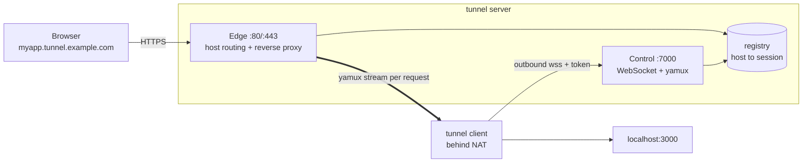
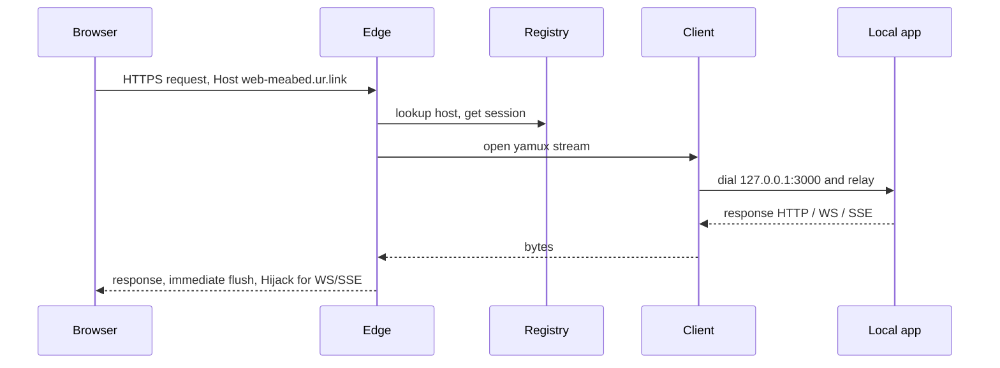

# tunnel

A self-hosted [ngrok](https://ngrok.com) alternative you fully own — **your own client and server**, no third party. Expose any local port at a public HTTPS URL through one outbound connection.

## Get started

```bash
# 1 · run the server (Docker — gets its own Let's Encrypt cert)
#     point *.tunnel.example.com + connect.tunnel.example.com at this host first
docker run -d --name tunnel -p 80:80 -p 443:443 -p 7000:7000 -v tunnel-data:/data \
  -e TUNNEL_DOMAIN=tunnel.example.com -e [email protected] \
  ghcr.io/ur-link/tunnel:latest
docker logs tunnel | grep ephemeral        # copy the auto-generated token

# 2 · expose a local app — from any machine, no install
npx @urlink/tunnel http 3000 \
  --server wss://connect.tunnel.example.com --token <token> --name myapp
#   ➜  https://myapp.tunnel.example.com
```

No server yet, just trying it locally? See [Quick start (local)](#quick-start-local). Other installs (brew, go, binary) and deploy recipes are below.



A **client** opens one persistent outbound WebSocket; inbound requests are multiplexed back over [yamux](https://github.com/hashicorp/yamux) (one stream per request) to your local service.

## Features

- **One static Go binary** — runs as `tunnel server` or `tunnel http <port>`.
- **yamux over WebSocket** — passes cleanly through Traefik/nginx L7 routers *or* runs standalone. No per-request connection setup → cheap for thousands of long-lived connections.
- **Long-connection first-class**: WebSocket upgrades, SSE/streaming (immediate flush), and idle-but-open sockets all work. No hard write timeout to sever them.
- **Dual TLS mode**: standalone on-demand ACME (per-host Let's Encrypt certs, no wildcard needed) *or* plain HTTP behind a TLS-terminating proxy.
- **Per-client tokens**, unlimited clients, requested-or-random subdomains, reserved names pinned to a token.
- **Cloud-native config**: defaults → file (JSON/TOML/YAML) → env (`TUNNEL_*`, `*_FILE` secrets) → flags. Zero-config-friendly.
- **Observability**: structured logs, Prometheus `/metrics`, JSON `/_tunnel/status`.

## Install

```bash
# npx (no install) — one command, both roles
npx @urlink/tunnel server --domain tunnel.example.com
npx @urlink/tunnel http 3000 --server wss://connect.tunnel.example.com --token <tok>

# npm (global)
npm i -g @urlink/tunnel        # provides the `tunnel` command

# Homebrew
brew install ur-link/tap/tunnel

# Go
go install github.com/ur-link/tunnel/cmd/tunnel@latest

# Docker (GitHub Container Registry or Docker Hub)
docker run --rm ghcr.io/ur-link/tunnel:latest version
docker run --rm urlink/tunnel:latest version
```

The npm package ships a tiny launcher that resolves a prebuilt binary for your platform (or downloads it from the GitHub release on first run), so `npx` always works on darwin/linux/windows × amd64/arm64.

## Self-host in 60 seconds

Point `*.tunnel.example.com` **and** `connect.tunnel.example.com` at your host, open ports 80/443/7000, then:

```bash
docker run -d --name tunnel --restart unless-stopped \
  -p 80:80 -p 443:443 -p 7000:7000 -v tunnel-data:/data \
  -e TUNNEL_DOMAIN=tunnel.example.com -e [email protected] \
  ghcr.io/ur-link/tunnel:latest
docker logs tunnel | grep ephemeral   # copy the auto-generated admin token
```

The server gets its own Let's Encrypt cert, persists it in the `tunnel-data` volume, and ships a built-in container **healthcheck** + auto-restart. From any machine:

```bash
npx @urlink/tunnel http 3000 \
  --server wss://connect.tunnel.example.com --token <token> --name myapp
#   ➜  https://myapp.tunnel.example.com
```

Compose: [`deploy/docker-compose.quickstart.yml`](deploy/docker-compose.quickstart.yml) · behind Traefik / standalone / wildcard / path-routing variants under [`deploy/`](deploy/) · bare-metal [`deploy/tunnel.service`](deploy/tunnel.service) (systemd). Set stable tokens later via `TUNNEL_TOKENS_FILE` ([docs/multi-tenant.md](docs/multi-tenant.md)).

## Quick start (local)

```bash
go build -o tunnel ./cmd/tunnel

# Terminal 1 — server (dev: TLS off, ephemeral token printed to logs)
./tunnel server --domain lvh.me --tls-mode off --http-addr :8080 --control-addr :7000

# Terminal 2 — client (forward local :3000)
./tunnel http 3000 --server ws://127.0.0.1:7000 --token <token-from-server-logs> --name myapp

# Terminal 3
curl -H 'Host: myapp.lvh.me' http://127.0.0.1:8080/
```

(`lvh.me` and `*.lvh.me` resolve to 127.0.0.1, handy for local testing.)

## Auto-discovery (`tunnel auto`)

Expose **every** dev server under a folder in one command — no per-service config. `tunnel auto` scans local listening ports, classifies the runtime, derives a slug from each project folder, and opens a tunnel per service. It's **path-contained**: only projects under the given path are touched, and it rescans to pick up servers as they start/stop.

```bash
# expose everything running under ~/code (token's namespace -> <slug>-<namespace>.<domain>)
npx @urlink/tunnel auto ~/code --server wss://connect.tunnel.example.com --token <tok>
#   ➜  https://web-meabed.ur.link   → 127.0.0.1:3000
#   ➜  https://api-meabed.ur.link   → 127.0.0.1:8080
```

Flags: `--path` (default cwd), `--all` (include non-web runtimes), `--runtimes node,bun`, `--interval 5s`. Discovery is ported from `portless-tailscale-proxy` (lsof/netstat → runtime classify → project-root slug).

## Configuration

Three interchangeable layers, later wins:

```
built-in defaults  →  config file (json|yaml|toml)  →  env (TUNNEL_*)  →  CLI flags
```

- File auto-detected at `./config.*`, `~/.tunnel/config.*`, `/etc/tunnel/config.*`, or `--config`.
- Every key has a `TUNNEL_*` env var (`tls_mode` → `TUNNEL_TLS_MODE`).
- Secrets accept a `*_FILE` variant (`TUNNEL_TOKENS_FILE`, `TUNNEL_TOKEN_FILE`) for Docker/K8s secret mounts.
- `tunnel server --print-config` dumps the resolved config (secrets redacted).

See [`examples/server.config.yaml`](examples/server.config.yaml) and [`examples/client.config.yaml`](examples/client.config.yaml) for every key.

### Token format

`token` or `token:reserved1|reserved2`, comma-separated inline or one-per-line in a file. A reserved name may only be claimed by its owning token; unreserved names are first-come-first-served.

## Deployment

**TLS modes** (full guide + copy‑paste setups in [docs/TLS.md](docs/TLS.md)):

| Mode | Cert source | Wildcard / DNS‑01 | Use when |
|------|-------------|-------------------|----------|
| `acme` | server, on‑demand Let's Encrypt (TLS‑ALPN‑01 / HTTP‑01) | ❌ per‑host | standalone, public |
| `file` | a cert you mount (e.g. wildcard from DNS‑01 tooling, hot‑reloaded) | ✅ | wildcard / own CA |
| `off`  | upstream proxy terminates TLS | ✅ (proxy) | behind Traefik/nginx/Caddy |

Persist `TUNNEL_TLS_CACHE_DIR` (acme cache) and mount your `config.yaml`/`tokens` under `/etc/tunnel` so restarts keep state — see [docs/TLS.md](docs/TLS.md).

### Standalone (own TLS)

```bash
tunnel server --domain tunnel.example.com --tls-mode acme [email protected]
```
Needs `*.tunnel.example.com` (and `connect.tunnel.example.com`) pointed at the host, and ports 443/7000 reachable. Certs are issued per-host on first request (TLS-ALPN-01) — no wildcard cert required. Compose version: [`deploy/docker-compose.standalone.yml`](deploy/docker-compose.standalone.yml).

### Behind Traefik (proxy does TLS)

See [`deploy/docker-compose.traefik.yml`](deploy/docker-compose.traefik.yml). The server runs `--tls-mode off --trust-forwarded`; Traefik supplies the wildcard cert via DNS-01 and routes `*.tunnel.example.com` → edge `:80` and `connect.tunnel.example.com` → control `:7000`.

### Docker

```bash
docker build -t tunnel .
docker run -p 80:80 -p 7000:7000 -p 9090:9090 \
  -e TUNNEL_DOMAIN=tunnel.example.com -e TUNNEL_TLS_MODE=off -e TUNNEL_TRUST_FORWARDED=true \
  -e TUNNEL_TOKENS_FILE=/run/secrets/tokens -v $PWD/secrets:/run/secrets:ro \
  tunnel server
```

## Multi-tenant, discovery & web UI

Tokens carry a **namespace** (`token@meabed`) so services become `<slug>-meabed.<domain>` and each user gets an auth-gated hub at `<namespace>.<domain>` plus an admin console at `admin.<domain>`. `tunnel auto [path]` discovers and exposes every dev server under a folder. Full design: [docs/multi-tenant.md](docs/multi-tenant.md).

## Architecture & observability

One WebSocket per client, yamux-multiplexed; the edge is `httputil.ReverseProxy` whose transport dials a **yamux stream** instead of a TCP port. A single public request flows:



Packages, the control handshake, edge host-routing flowchart, the discovery flow, and all HTTP/API surfaces (control, `/metrics`, `/_tunnel/status`, admin & hub APIs) — with more diagrams — are in **[docs/architecture.md](docs/architecture.md)**.

**Observability:** `GET /metrics` (Prometheus: `tunnel_active_clients`, `tunnel_active_streams`, `tunnel_requests_total`, `tunnel_bytes_{in,out}_total`), `GET /_tunnel/status` (JSON tunnel list), `GET /healthz`.

## Development

```bash
make test-race   # race suite (unit + in-process e2e: HTTP, SSE, WebSocket, concurrency)
make lint        # gofmt + go vet
make generate    # regenerate templ UI after editing internal/web/*.templ
```

Contributor rules, code style, and patterns live in **[AGENT.md](AGENT.md)**; testing approach in **[docs/testing.md](docs/testing.md)**.
