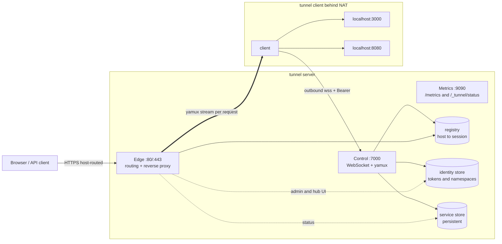
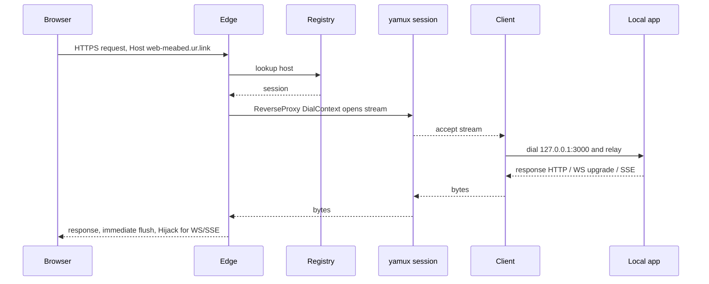
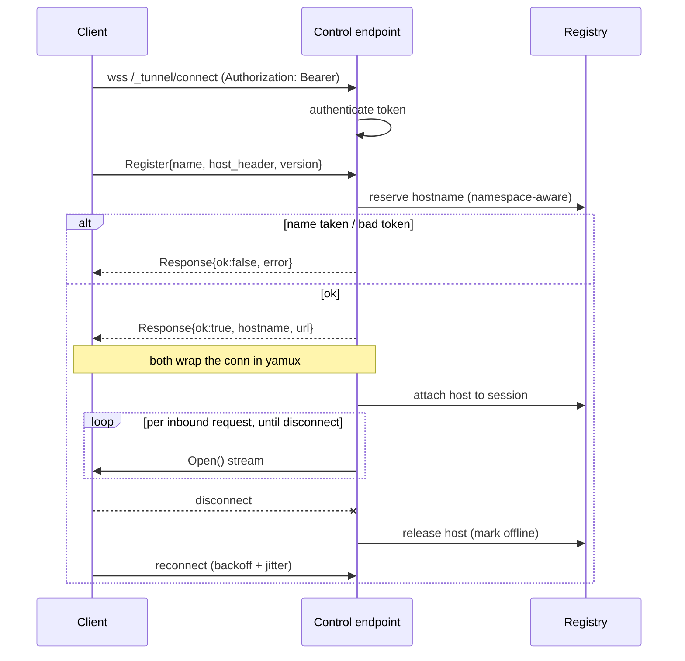
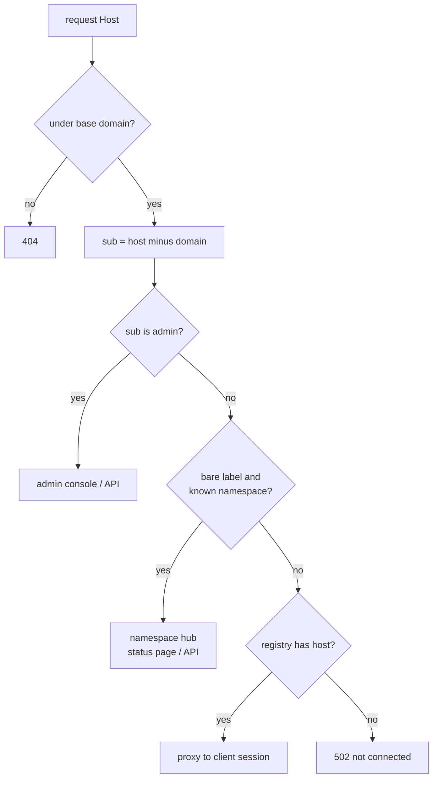
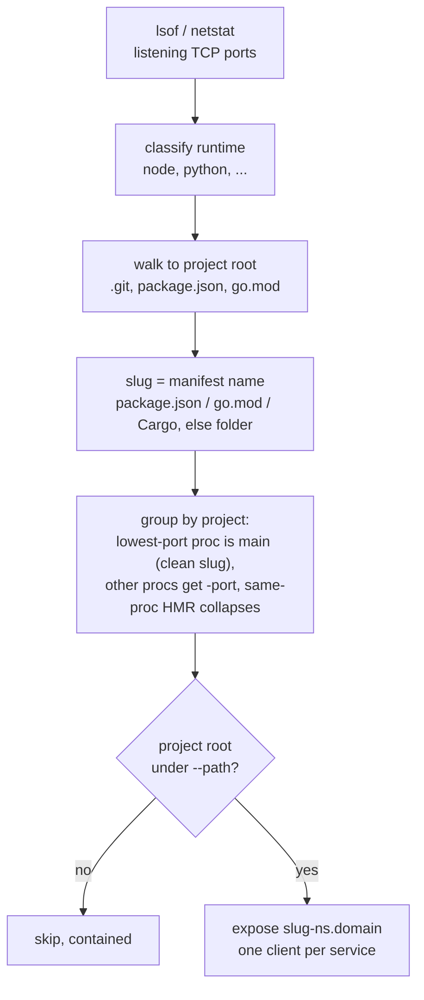

# Architecture & API flow

Product overview: [README](../README.md). TLS specifics: [TLS.md](TLS.md). Multi-tenant model: [multi-tenant.md](multi-tenant.md).

## Packages

| Package | Responsibility |
|---|---|
| `cmd/tunnel` | CLI dispatch: `server` · `http <target>` · `auto [path]` · `version` |
| `internal/config` | layered config (defaults → file → env `TUNNEL_*` → flags), one struct per binary |
| `internal/proto` | control handshake framing (`Register` → `Response`) + `ControlPath` |
| `internal/mux` | WebSocket ↔ `net.Conn` adapter + yamux session tuning |
| `internal/server` | edge reverse proxy, control plane, registry, identity/auth, TLS, metrics, web UI wiring |
| `internal/client` | persistent connect + accept-stream loop + local relay + reconnect; `auto.go` orchestrates discovery |
| `internal/discover` | local dev-server discovery (lsof/netstat → runtime classify → project slug) |
| `internal/web` | templ + HTMX admin console & status pages (embedded assets) |
| `internal/logging` | slog logger (auto text/json) |

## System overview

## Data path (one public request)

One WebSocket per client; **yamux** multiplexes one stream per inbound request. The server opens streams, the client accepts them — no per-request connection setup.

## Control handshake (`internal/proto`, `server/control.go`, `client/client.go`)

1. Client dials `wss://<control>/_tunnel/connect` with `Authorization: Bearer <token>` (or `?token=`).
2. Server authenticates, wraps the WS as a `net.Conn`, reads `proto.Register{Name, HostHeader, ClientVersion}`.
3. Server reserves a hostname (namespace-aware), replies `proto.Response{OK, Hostname, URL}` (or `OK:false, Error`).
4. Both wrap the conn in yamux (server = `yamux.Server`, client = `yamux.Client`); server registers `host → session`.
5. On disconnect: client reconnects with backoff; server unregisters and marks the service offline.

## Edge host routing (`server/edge.go`)

`edgeRoute(host)` strips port + base domain → `sub`, `full`:
- `sub == control-host` (default `connect`) → the **control plane** (`/_tunnel/connect`), so clients reach it over the edge's TLS at `wss://connect.<domain>` — a single port, no separate `:7000` exposure (the dedicated control listener still runs for behind-proxy/L4 setups).
- `sub == "admin"` → admin console/API.
- bare namespace label (no dot, known namespace) → that namespace's **hub** — `handleHub` in subdomain mode, or `handlePathNamespace` in path mode (`routing_mode=path`: services at `/<slug>/`, prefix stripped, `tn_route` affinity cookie).
- otherwise → **service**: `registry.lookup(full)` → session proxy. Service hosts are `<slug>-<ns>.<domain>` (flat) or `<slug>.<ns>.<domain>` (nested).

## HTTP surfaces

| Listener | Path | Auth | Purpose |
|---|---|---|---|
| control (`:7000`) | `/_tunnel/connect` | Bearer token | client WebSocket + yamux |
| control / metrics | `/healthz` | none | liveness |
| metrics (`:9090`) | `/metrics` | none (bind localhost) | Prometheus |
| metrics | `/_tunnel/status?namespace=` | none | JSON service list |
| edge `admin.<domain>` | `/api/users` (GET/POST), `/api/users/{token}` (PATCH/DELETE), `/api/users/{token}/rotate` (POST), `/api/services` | admin Bearer | identity CRUD JSON API |
| edge `admin.<domain>` | `/`, `/login`, `/users*`, `/partials/services`, `/_static/*` | admin cookie | web console |
| edge `<namespace>.<domain>` | `/api/services` | namespace token / admin | hub JSON API |
| edge `<namespace>.<domain>` | `/`, `/login`, `/partials/services` | namespace cookie | status page |

Browser auth = the token in an httpOnly cookie (`tn_admin` / `tn_hub`); CLI/automation = `Authorization: Bearer`.

## Reverse-proxy core

`httputil.ReverseProxy` with `FlushInterval: -1` (SSE/streaming) and a `statusRecorder` exposing `Hijack`/`Flush` (WebSocket upgrades). The transport's `DialContext` opens a yamux stream to the session instead of dialing TCP — the only change from a normal reverse proxy. No hard `WriteTimeout` (would sever long-lived streams); rely on `ReadHeaderTimeout` + `IdleTimeout` + yamux keepalive.

## Discovery (`tunnel auto`)

`internal/discover` finds local dev servers and the client orchestrator (`client/auto.go`) opens one tunnel per service, rescanning on an interval.

