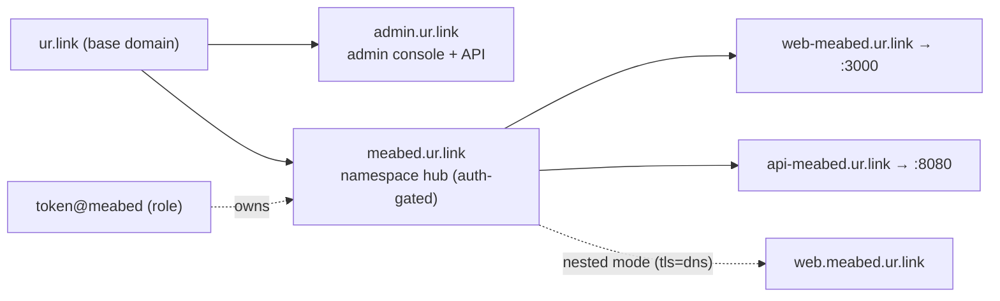

# Multi-tenant namespaces + discovery (design)

Status: **approved direction**, building in phases. Main domain: `ur.link`.

## Model

- A **token** belongs to a **user/namespace** (e.g. `meabed`). One token → one namespace.
- A user exposes many **services**. Each service gets a **single-level** hostname:
  `**<slug>-<namespace>.ur.link**` (e.g. `web-meabed.ur.link`, `api-meabed.ur.link`).
  - Single level on purpose: one `*.ur.link` wildcard cert covers everything. No per-user
    DNS-01 certs. (Nested `slug.namespace.ur.link` is explicitly out of scope unless/until we
    build per-user DNS-01 automation.)
- **Namespace ownership** is enforced: a token may only register hostnames ending in
  `-<its-namespace>.ur.link`. Cross-user squatting is therefore impossible.
- The **hub** at `<namespace>.ur.link` is an **auth-gated** page listing that namespace's
  services (live + last-seen). Auth = the namespace's token (Bearer or a simple login).
- **Persistence**: a structured, file-backed store survives restarts —
  - users: token → {namespace, label} (structured YAML/JSON; inline legacy format still works)
  - services: append/update log of `{namespace, slug, host, first_seen, last_seen, online}`
    so the hub can show offline services too. JSONL audit + compacted state file.

### Host map

Default naming is single-level `<slug>-<namespace>` (one `*.ur.link` wildcard). Nested `<slug>.<namespace>` needs `tls-mode=dns` (per-namespace `*.<ns>.ur.link` certs).

## Routing modes (`routing_mode`)

| Mode | Service address | Notes |
|---|---|---|
| `subdomain` (default) | `<slug>-<ns>.<domain>` (or nested `<slug>.<ns>.<domain>`) | host-routed; needs a wildcard cert |
| `path` | `<ns>.<domain>/<slug>/` | the namespace host routes by first path segment; sets a `tn_route` affinity cookie so an app's prefix-less asset/API requests follow the last service. Only needs `*.<domain>` (one level). Reserved slugs: `admin login logout api partials _static _tunnel healthz connect`. |

Both modes share the same client and tokens — the server decides addressing. The status/admin pages and `/api/...` work in either mode; in path mode they live under reserved paths on the namespace host.

### Hot reload (no dropped connections)
The identity store and TLS file certs reload **live** when their files change on disk:
- **Tokens / users**: a watcher reloads the identity store under lock. Active tunnels live in
  the **registry**, which is independent of the identity store — so adding/revoking a user or
  changing a namespace affects only *new* connections; existing sessions are never dropped.
- **TLS (`file` mode)**: the cert is already hot-reloaded on renewal (`certReloader`).
- **Not live-reloadable** (need a restart): listen addresses and the base `domain` — they define
  the topology. Everything operational (identities, certs, reserved names) reloads in place.

### Backward compatibility
A token with **no namespace** keeps today's behavior: flat `<slug>.ur.link`, first-come names.
Namespaced tokens switch to `<slug>-<namespace>` and ownership enforcement.

## Discovery client (`npx @urlink/tunnel`)

Port the scanning brain from `portless-tailscale-proxy` (lsof/netstat → runtime classify →
walk to project root → derive slug). Default mode when run with no explicit target:

- **Path-contained**: only consider dev servers whose project root is under `--path`
  (default: cwd). Won't expose unrelated local ports — "contained" to that tree.
- **Expose ALL** discovered services in that path, each registered as `<slug>-<namespace>.ur.link`.
- `--one` / explicit `http <port>` registers a single service.
- Re-derive on change (servers come/go) and keep the registry in sync, like portless's poll loop.

## Roles & access

- **user**: owns one namespace; can open tunnels in it and view its own status page.
- **admin**: manages the service — CRUD users, rotate/revoke tokens, assign namespaces,
  see all namespaces/services. Admin console is auth-gated (admin role), e.g. `admin.ur.link`.

## APIs (JSON, behind auth)

- **Admin API** (admin token): list/create/update/delete users, regenerate tokens, set
  namespace/label/role. Backed by the persistent identity store.
- **User status API** (user token): list this namespace's services (live + last-seen).
- These power both the UIs and `npx`/CI automation.

## Frontend (both UIs)

[a-h/templ](https://github.com/a-h/templ) (typed Go HTML components, `templ generate`) + **HTMX**
(server-driven live updates — refresh service lists without a JS SPA) + [templui](https://templui.io)
(Tailwind component library). Server-rendered; `templ generate` + Tailwind build added to the
pipeline; assets embedded via `embed.FS` so the binary stays single-file.

**Design quality**: build the UIs through the `hallmark` (anti-AI-slop design) and
`frontend-design` skills so they look intentional and polished, not generic.

- **Admin console**: users table, create/edit user (namespace, label, role), rotate/revoke token.
- **User status page** (`<namespace>.ur.link`): the namespace's services, online/offline, links,
  request/traffic stats, copy-url.

## Phases

1. **Server foundation** (this build): identity store (token → {namespace, label, role};
   structured + legacy inline), persistent + file-backed with CRUD methods; namespace-aware
   naming (`<slug>-<namespace>`) + ownership enforcement; persistent service registry
   (online/offline/last-seen); status API extended with namespace. *No behavior change for
   non-namespaced tokens.*
2. **Admin + user APIs** ✅ *done*: writable JSON identity store + CRUD/rotate;
   admin API at `admin.<domain>` (admin-role Bearer); per-namespace hub API at
   `<namespace>.<domain>` (own token or admin). Edge routes admin/hub/service by host.
3. **UIs** ✅ *done*: templ + vendored HTMX + hand-crafted OKLCH styles (modern-minimal,
   per the hallmark/frontend-design discipline), embedded in the binary. Admin console
   (`admin.<domain>`: users table, create/rotate/delete, live service list) + per-namespace
   status page (`<namespace>.<domain>`), cookie-authenticated, with live HTMX refresh.
   Generated `*_templ.go` is committed (CI builds without the templ CLI; `make generate`
   to regenerate). templui/Tailwind can layer on later.
4. **Discovery client** ✅ *done*: `tunnel auto [path]` ports portless scanning
   (lsof/netstat → runtime classify → project-root slug), `--path` containment
   (symlink-resolved), expose-all, rescan loop; one reused client per service.
5. **Polish**: name-match heuristics; (optional) per-user DNS-01 for nested subdomains.

## TLS
`*.ur.link` wildcard via `tls-mode=file` (DNS-01 issued out of band) or behind a proxy
(`tls-mode=off`). Single-level naming means one cert forever. See [TLS.md](TLS.md).
